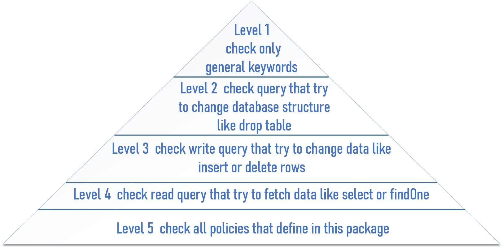

# Perfect Express Sanitizer

<div style="display: flex;">

[](https://www.npmjs.com/package/perfect-express-sanitizer)

[]()
[](https://opensource.org/licenses/MIT)

</div>


`perfect-express-sanitizer` is a comprehensive package that helps you control user input data to prevent Cross-Site Scripting (XSS), SQL injection, and NoSQL injection attacks. It can sanitize the body, query, and header of requests to remove any potentially harmful data.

## Installation

You can install `perfect-express-sanitizer` via NPM:

```bash
npm install perfect-express-sanitizer
```

## Usage

### Basic usage

You can use perfect-express-sanitizer in any JavaScript project, not just with Express. Here’s an example of how to use the prepareSanitize method to sanitize a string:

```javascript
const perfectExpressSanitizer = require("perfect-express-sanitizer");

const input = "<script>alert('test')</script> bob miler";
const options = { xss: true, noSql: true, sql: true, level: 5 };
const sanitizedInput = perfectExpressSanitizer.sanitize.prepareSanitize(
  input,
  options
);

console.log(sanitizedInput);
// Output: " bob miler"
```

#### Middleware

You can also use `perfect-express-sanitizer` as a middleware in an Express app to automatically sanitize all incoming requests. Here’s an example of how to set it up:

```javascript
const sanitizer = require("perfect-express-sanitizer");

app.use(
  sanitizer.clean({
    xss: true,
    noSql: true,
    sql: true,
  })
);
```

### Advance Usage

#### Define custom keyword to sanitize

 `customizeFile`, which allows you to define custom keywords to sanitize sensitive data. This is perfect for cases where you want to avoid false positives and ensure that your real data is not wrongly lost.

 #### How to Use `customizeFile`

To use this feature, simply follow these steps:

1. Create a JSON file containing your custom keywords like following custom_file.json.
    ```json
    [
        {
            "keyword": "deleteCustom"
        },
        {
            "keyword": "dropCustom"
        }
    ]
    ```
2. Add the file path as the value for the `customizeFile` option when setting up the middleware.
Here's an example: 
    ```javascript
    app.use(
      sanitizer.clean({
        xss: true,
        noSql: true,
        sql: true,
        customizeFile: './custom_file.json'
      })
    );
    ```

#### Define custom keyword and regular expressions to sanitize

`perfect-express-sanitizer` allows you to define custom keywords to sanitize from sensitive data. You can specify these keywords as strings or regular expressions in the forbiddenTags option when setting up the middleware. Here’s an example of how to define a custom keyword as a string:
</br>
In this example, the `.execute` keyword is added to the list of forbidden tags, so it will be removed from any data that is sanitized by the middleware.

```javascript
sanitizer.clean({
  xss: true,
  noSql: true,
  level: 5,
  forbiddenTags: [".execute"],
});
```

You can also use regular expressions to define more complex patterns for forbidden tags. Here’s an example of how to use a regular expression to remove any instances of a digit followed by an equals sign followed by another digit
</br>
In this example, the regular expression `/\d=\d/gm` is added to the list of forbidden tags, so any matches will be removed from the data.
```javascript
sanitizer.clean({
    xss: true,
    noSql: true,
    level: 5,
    forbiddenTags: [/\d=\d/gm,".execute"],
})
```


#### Whitelisting Routes

If you want to skip sanitization for certain routes, you can specify a whitelist of routes when setting up the middleware:

```javascript
const whiteList = ["/users", "/users/list", "/users/search?age"];

app.use(
  sanitizer.clean(
    {
      xss: true,
      noSql: true,
      sql: true,
    },
    whiteList
  )
);
```

#### Limit Sanitization

By default, `perfect-express-sanitizer` sanitizes all parts of the request (body, query, and header). If you only want to sanitize specific parts of the request, you can specify them when setting up the middleware:

```javascript
app.use(
  sanitizer.clean(
    {
      xss: true,
      noSql: true,
      sql: true,
    },
    whiteList = [],
    only = ["body", "query"]
  )
);
```

 For an option that sanitizes keys, you could consider the following option `sanitizeKeys: true` example:
 
 ```javascript
app.use(
  sanitizer.clean(
    {
      xss: true,
      noSql: true,
      sanitizeKeys: true,
    },
    whiteList = [],
    only = ["body", "query"]
  )
);
```


#### Setting Sanitization Levels

You can set different levels of sanitization for SQL and NoSQL injections by specifying the sqlLevel and noSqlLevel options when setting up the middleware. The levels range from 1 to 5, with higher levels providing more comprehensive sanitization.

<!--  -->



```javascript
app.use(sanitizer.clean({
    xss: true,
    noSql: true,
    sql: true,
    sqlLevel: 5,
    noSqlLevel: 5
}));
```
##### Allowing Specific Keys
You can also specify a list of allowed keys that should be skipped during sanitization. Here’s an example of how to allow the name key:

```javascript
app.use(
  sanitizer.clean({
    xss: true,
    noSql: true,
    sql: true,
    sqlLevel: 5,
    noSqlLevel: 5,
    allowedKeys: ["name"],
  })
);
```

##### Detecting Injection Attempts

In addition to sanitizing user input, perfect-express-sanitizer also provides methods for detecting dangerous keywords in user input. These methods can be used to check for XSS, SQL injection, and NoSQL injection attempts. Here are some examples of how to use these methods:

```javascript
const perfectExpressSanitizer = require("perfect-express-sanitizer");

// Detecting XSS attempts:
const hasXss = await perfectExpressSanitizer.detectXss('bob try to <"alert(1)');
console.log(hasXss); // Output: true

// Detecting SQL injection attempts:
const hasSqlInjection = await perfectExpressSanitizer.detectSqlInjection('bob try to create table', 5);
console.log(hasSqlInjection); // Output: true

// Detecting NoSQL injection attempts:
const hasNoSqlInjection = await perfectExpressSanitizer.detectNoSqlInjection('bob try to findOne', 5);
console.log(hasNoSqlInjection); // Output: true
```

## Support

- [Bug Reports](https://github.com/hamedpa/perfect-express-sanitizer/issues/)

## Contributors

<p>
Pull requests are always welcome! Please base pull requests against the main branch and follow the contributing guide.

if your pull requests makes documentation changes, please update readme file.

</p>

## License

This project is licensed under the terms of the
MIT license
